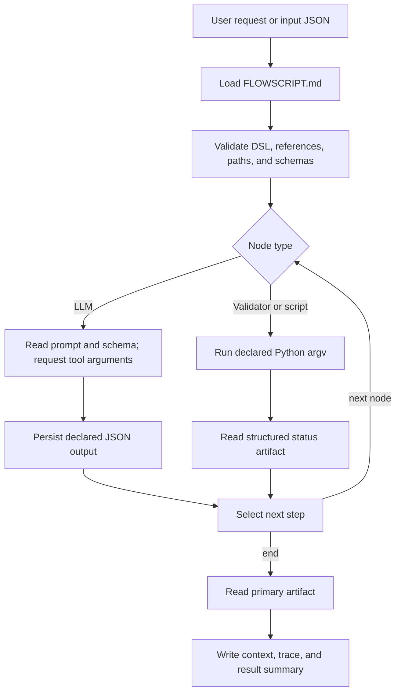

# FlowScript Skill Runtime

[中文说明](README_cn.md)

FlowScript Skill Runtime is a validation-oriented MVP for turning a Markdown-defined skill into a controlled, inspectable workflow. It reads a `flow` DSL block from `FLOWSCRIPT.md`, runs LLM, validator, and Python script nodes in a fixed order, selects branches from structured status files, and records the complete interaction as an OpenAI-style Skill Agent context.

The repository also includes a bilingual FlowScript skill generator and a synthetic CSV data-quality demo in separate Chinese and English packages.

> This is an experimental runtime for workflow and trace validation. It is not a production orchestration platform or a security sandbox.

## Project goals

The project explores a simple question: can a reusable agent skill remain readable as Markdown while also being executable as a deterministic workflow?

Its main goals are to:

- keep `SKILL.md` useful to an ordinary agent;
- add an explicit workflow contract in `FLOWSCRIPT.md` for a compatible harness;
- keep models responsible for structured interpretation, not execution order;
- run deterministic work through declared Python scripts;
- branch only on validated, structured state;
- persist every important artifact and tool exchange;
- produce a replayable `skill_agent_context.json` that resembles a normal agent conversation.

## Repository contents

```text
.
├── minimal_flowscript_agent/        # Python runtime and design documents
├── skills_en/
│   ├── flowscript-skill-generator/  # English skill-package generator
│   └── csv-quality-report-demo/     # English executable demo
├── skills_cn/
│   ├── flowscript-skill-generator/  # Chinese skill-package generator
│   └── csv-quality-report-demo/     # Chinese executable demo
├── flowscript-skill-generator-design_en.md
└── flowscript-skill-generator-design_cn.md
```

The CSV demo generates deterministic synthetic records, filters them by date, profiles data quality, groups results by employee or region, asks a model for a structured interpretation, validates that interpretation, and renders a Markdown report.

## How it works



The `WorkflowEngine` alone controls execution order. The model cannot choose shell commands, output paths, or branch targets.

## Requirements

- Python 3.11 or newer
- PyYAML 6.0 or newer
- An OpenAI-compatible Chat Completions endpoint for LLM nodes

The default endpoint is `http://127.0.0.1:1234/v1/chat/completions`, and the default model name is `qwen3.5-0.8b`. Both are CLI options.

## Installation

From the repository root:

```bash
python -m venv .venv
```

Activate the environment:

```bash
# macOS/Linux
source .venv/bin/activate

# Windows PowerShell
.venv\Scripts\Activate.ps1
```

Install the runtime in editable mode:

```bash
python -m pip install -e minimal_flowscript_agent
```

Verify the CLI:

```bash
minimize-agent --help
```

## Running the demo

Start an OpenAI-compatible local model server first, then run one of the language-specific demo skills.

### Natural-language request

```bash
minimize-agent run \
  --skill skills_en/csv-quality-report-demo \
  --request "Generate 500 synthetic records for Alice and Bob in East and West, grouped by employee." \
  --language en \
  --model qwen3.5-0.8b \
  --endpoint http://127.0.0.1:1234/v1/chat/completions
```

For the Chinese package:

```bash
minimize-agent run \
  --skill skills_cn/csv-quality-report-demo \
  --request "为张伟和李娜生成 500 条华东、华南区域的模拟数据，并按员工分组。" \
  --language zh
```

### Structured input

`--input-json` skips the first model-based request-parsing call. Later LLM steps, such as profile interpretation, still require the model endpoint.

Create `input.json`:

```json
{
  "employees": ["Alice", "Bob"],
  "regions": ["East", "West"],
  "group_by": "employee",
  "record_count": 500,
  "seed": 42,
  "report_title": "Employee and Region Data Quality Report"
}
```

Run it:

```bash
minimize-agent run \
  --skill skills_en/csv-quality-report-demo \
  --input-json input.json \
  --run-id demo-001 \
  --language en
```

Run IDs must be new. The MVP does not resume or overwrite an existing run.

### Authentication and language

Set `MINIMIZE_AGENT_API_KEY` when the model endpoint expects a bearer token:

```bash
export MINIMIZE_AGENT_API_KEY="your-token"
```

Language resolution order is:

1. `--language zh|en`;
2. `MINIMAL_FLOWSCRIPT_AGENT_LANG`;
3. operating-system locale and `LANG`/`LC_*`;
4. English fallback.

For the clearest output, use `--language en` with `skills_en` and `--language zh` with `skills_cn`.

## Run artifacts

A successful CSV demo run has this shape:

```text
skills_en/csv-quality-report-demo/runs/<run_id>/
├── resolved_params.json
├── valid_params.json
├── data/
│   └── generated_data.csv
├── artifacts/
│   ├── validation_status.json
│   ├── profile.json
│   ├── profile_status.json
│   ├── interpretation.json
│   ├── interpretation_status.json
│   ├── final_report.md
│   ├── finalize_status.json
│   ├── artifacts_manifest.json
│   └── fallback_context.json       # Present only on recoverable failures
└── runtime/
    ├── trace.jsonl
    ├── skill_agent_context.json
    └── result.json
```

The skill owns business artifacts under `data/` and `artifacts/`. The runtime owns the three files under `runtime/`.

## `skill_agent_context.json`

`skill_agent_context.json` is the primary inspection and replay artifact. It is a top-level JSON array of OpenAI-style conversation messages, not an object with metadata fields.

A simplified example:

```json
[
  {
    "role": "user",
    "content": "Analyze Alice and Bob in East and West by employee."
  },
  {
    "role": "assistant",
    "content": "",
    "tool_calls": [
      {
        "id": "call_0001",
        "type": "function",
        "function": {
          "name": "read_file",
          "arguments": "{\"path\":\"prompts/parse_request_en.md\",\"max_bytes\":64000}"
        }
      }
    ]
  },
  {
    "role": "tool",
    "tool_call_id": "call_0001",
    "name": "read_file",
    "content": "{\"status\":\"success\",\"path\":\"prompts/parse_request_en.md\",\"bytes\":640}"
  },
  {
    "role": "assistant",
    "content": "FlowScript Skill execution completed."
  }
]
```

### Message variants

| Message | Required fields | Meaning |
|---|---|---|
| User message | `role`, `content` | The original natural-language request, or serialized structured input. |
| Assistant tool call | `role`, `content`, `tool_calls` | A Skill Agent action represented as one or more function calls. |
| Tool result | `role`, `tool_call_id`, `name`, `content` | The result paired with a preceding tool-call ID. |
| Final assistant message | `role`, `content` | Localized completion or failure text, optionally followed by the final report. |

Each `tool_calls[].function.arguments` value is a JSON-encoded string. Each tool message's `content` is also usually a JSON-encoded string. Consumers must parse the outer message array first, then parse these inner strings when they need structured values.

### Typical tool sequence

A complete demo context usually records:

1. the user request;
2. `read_file` for the selected prompt;
3. `read_json` for the input or output schema;
4. `submit_skill_inputs` with model-produced or supplied structured inputs;
5. `write_json` to persist resolved parameters;
6. `exec` for validation and deterministic processing scripts;
7. `read_json` for status, profile, and branch inputs;
8. `submit_interpretation` for schema-constrained LLM output;
9. `write_json` to persist that interpretation;
10. `read_file` for the final report;
11. the final assistant message.

Tool-call IDs are monotonically assigned as `call_0001`, `call_0002`, and so on. The context intentionally excludes internal events such as node starts and branch evaluator details; those belong in `trace.jsonl`.

### Large results and output limits

- Text or JSON files up to 64,000 bytes may be embedded in full.
- Larger files are represented by path, byte size, SHA-256, and a preview.
- Large CSV summaries also include a data-row count.
- `exec` stores the last 16,000 characters of stdout and stderr.

This keeps the context inspectable without embedding an entire generated dataset.

## `trace.jsonl` and `result.json`

The three runtime artifacts serve different audiences:

| File | Purpose | Structure |
|---|---|---|
| `skill_agent_context.json` | Agent-style replay, auditing, and downstream context | JSON array of user/assistant/tool messages |
| `trace.jsonl` | Runtime debugging and test assertions | One event object per line |
| `result.json` | Compact run summary | One JSON object |

Each trace event contains:

```json
{
  "seq": 1,
  "timestamp": 1783512626.49,
  "run_id": "demo-001",
  "step_id": "parse_request",
  "actor": "runtime",
  "event": "node_started",
  "payload": {}
}
```

Common event types include `run_started`, `node_started`, `model_request`, `model_tool_call`, `tool_call`, `tool_result`, `artifact_written`, `branch_selected`, `node_completed`, `node_failed`, `unsupported_terminal`, and `run_completed`.

`result.json` summarizes status, run ID, language, completed steps, selected branches, context and trace paths, tool/model call counts, elapsed time, and either the primary artifact or failure information.

Even when execution fails, the runtime writes `result.json`, appends a failure message to the context, flushes `skill_agent_context.json`, and retains the trace collected so far.

## FlowScript skill contract

A runtime-compatible skill normally contains:

```text
my-skill/
├── SKILL.md
├── FLOWSCRIPT.md
├── input_schema.json
├── agents/openai.yaml
├── prompts/
├── schemas/
├── scripts/
├── references/
└── tests/replay_cases.jsonl
```

`FLOWSCRIPT.md` must contain exactly one fenced `flow` block. The MVP currently supports:

- FlowScript `version: 1` and `mode: controlled`;
- `llm`, `validator`, `script`, and `terminal` nodes;
- one declared output for each LLM node;
- Python script commands expressed as argv arrays;
- `${...}` references to user input and prior outputs;
- `==` and `!=` branch comparisons against JSON status fields;
- prompt paths as a scalar or a non-empty `zh`/`en` mapping;
- output paths confined to the skill root.

The generator skills under `skills_en/flowscript-skill-generator` and `skills_cn/flowscript-skill-generator` document the package contract and provide reusable templates.

## Safety boundaries

The runtime reduces accidental freedom but is not a hardened sandbox:

- only declared Python script commands are accepted;
- commands use argv with `shell=False`;
- script paths and artifact paths must stay under the skill root;
- working directory is fixed to the skill root;
- command timeouts and accepted exit codes are explicit;
- models submit schema-constrained content but do not select commands or branches;
- branches read structured artifact values rather than free-form model text.

Review every skill and bundled script before running it. A permitted Python script still executes with the permissions of the current process.

## MVP limitations

- No pause/resume or overwrite of existing runs.
- No multi-turn clarification.
- Clarification and fallback terminals are recorded, then treated as unsupported.
- No loops, parallel nodes, dynamic nodes, or distributed execution.
- No model-selected shell commands.
- Only a small JSON Schema subset is validated.
- `tests/replay_cases.jsonl` files are replay fixtures; this repository does not yet include a full automated replay runner.

## Project governance

This project is licensed under the [Apache License 2.0](LICENSE). Contributions intentionally submitted for inclusion are accepted under the same license unless explicitly stated otherwise.

- Read [CONTRIBUTING.md](CONTRIBUTING.md) for development setup, checks, and pull-request expectations.
- Report vulnerabilities according to [SECURITY.md](SECURITY.md), not through a public issue.
- GitHub Actions runs static validation for Python, FlowScript plans, structured files, documentation links, and the license.
- `.gitignore` excludes Python caches, virtual environments, local secrets, editor files, logs, and generated `runs/` directories.

Before the first versioned release, the maintainers should still choose the canonical copyright-holder name for optional source-file notices, define a versioning policy, confirm that any intentionally published sample runs are sanitized, and consider adding a short recorded demo.

## Design documents

- [Minimal FlowScript Agent design](minimal_flowscript_agent/flowscript-agent-design_en.md)
- [FlowScript skill generator design](flowscript-skill-generator-design_en.md)
- [Chinese runtime design](minimal_flowscript_agent/flowscript-agent-design_cn.md)
- [Chinese generator design](flowscript-skill-generator-design_cn.md)