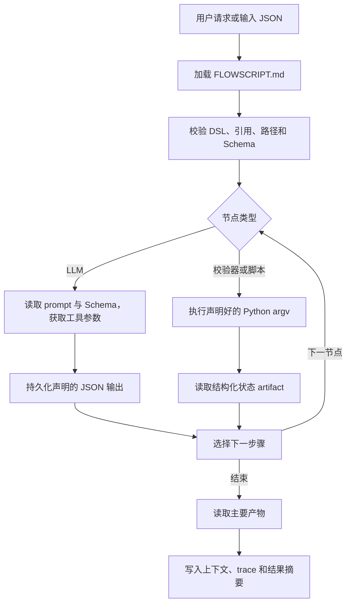

# FlowScript Skill Runtime

[English README](README.md)

FlowScript Skill Runtime 是一个面向验证场景的 MVP：它把 Markdown 定义的 skill 转换为受控、可检查的工作流。运行时从 `FLOWSCRIPT.md` 读取 `flow` DSL，按固定顺序执行 LLM、校验器和 Python 脚本节点，根据结构化状态文件选择分支，并把完整交互记录为 OpenAI 风格的 Skill Agent 上下文。

仓库同时提供中英文 FlowScript skill 生成器，以及一个生成模拟 CSV 并完成数据质量分析的中英文 Demo。

> 当前项目用于验证工作流、artifact 和调用链设计，不是生产级编排平台，也不是安全沙箱。

## 项目目标

项目尝试回答一个简单的问题：一个可复用的 agent skill，能否既保持 Markdown 的可读性，又能被 runtime 作为确定性工作流执行？

主要目标包括：

- 让普通 agent 仍然可以阅读并执行 `SKILL.md`；
- 用 `FLOWSCRIPT.md` 为兼容 harness 提供明确的工作流契约；
- 让模型负责结构化理解，而不负责决定执行顺序；
- 通过声明好的 Python 脚本执行确定性任务；
- 只根据校验过的结构化状态进行分支；
- 持久化重要 artifact 和每次工具交互；
- 生成可回放的 `skill_agent_context.json`，模拟普通 Agent 会话。

## 仓库内容

```text
.
├── minimal_flowscript_agent/        # Python runtime 与设计文档
├── skills_en/
│   ├── flowscript-skill-generator/  # 英文 skill 包生成器
│   └── csv-quality-report-demo/     # 英文可执行 Demo
├── skills_cn/
│   ├── flowscript-skill-generator/  # 中文 skill 包生成器
│   └── csv-quality-report-demo/     # 中文可执行 Demo
├── flowscript-skill-generator-design_en.md
└── flowscript-skill-generator-design_cn.md
```

CSV Demo 会生成确定性的模拟记录，按时间筛选，完成字段与数据质量画像，按员工或区域聚类，调用模型生成结构化解读，校验解读，最后输出 Markdown 报告。

## 运行原理



只有 `WorkflowEngine` 能决定执行顺序。模型不能选择 shell 命令、输出路径或分支目标。

## 环境要求

- Python 3.11 或更高版本
- PyYAML 6.0 或更高版本
- 能执行 LLM 节点的 OpenAI-compatible Chat Completions 服务

默认 endpoint 为 `http://127.0.0.1:1234/v1/chat/completions`，默认模型名称为 `qwen3.5-0.8b`，两者都可以通过命令行覆盖。

## 安装

在仓库根目录执行：

```bash
python -m venv .venv
```

激活虚拟环境：

```bash
# macOS/Linux
source .venv/bin/activate

# Windows PowerShell
.venv\Scripts\Activate.ps1
```

以 editable 模式安装 runtime：

```bash
python -m pip install -e minimal_flowscript_agent
```

检查 CLI：

```bash
minimize-agent --help
```

## 运行 Demo

先启动 OpenAI-compatible 本地模型服务，再运行对应语言的 Demo skill。

### 使用自然语言请求

```bash
minimize-agent run \
  --skill skills_cn/csv-quality-report-demo \
  --request "为张伟和李娜生成 500 条华东、华南区域的模拟数据，并按员工分组。" \
  --language zh \
  --model qwen3.5-0.8b \
  --endpoint http://127.0.0.1:1234/v1/chat/completions
```

英文 Demo：

```bash
minimize-agent run \
  --skill skills_en/csv-quality-report-demo \
  --request "Generate 500 synthetic records for Alice and Bob in East and West, grouped by employee." \
  --language en
```

### 使用结构化输入

`--input-json` 会跳过第一次基于模型的请求解析。后续 LLM 节点（例如画像解读）仍然需要模型服务。

创建 `input.json`：

```json
{
  "employees": ["张伟", "李娜"],
  "regions": ["华东", "华南"],
  "group_by": "employee",
  "record_count": 500,
  "seed": 42,
  "report_title": "员工与区域数据质量报告"
}
```

执行：

```bash
minimize-agent run \
  --skill skills_cn/csv-quality-report-demo \
  --input-json input.json \
  --run-id demo-001 \
  --language zh
```

每个 run ID 必须是新的。当前 MVP 不支持恢复或覆盖已有运行。

### 认证与语言

如果模型 endpoint 需要 Bearer Token，可设置：

```bash
export MINIMIZE_AGENT_API_KEY="your-token"
```

语言解析顺序为：

1. `--language zh|en`；
2. `MINIMAL_FLOWSCRIPT_AGENT_LANG`；
3. 操作系统 locale 及 `LANG`/`LC_*`；
4. 默认英文。

建议 `skills_cn` 配合 `--language zh`，`skills_en` 配合 `--language en`。

## 运行产物

一次成功的 CSV Demo 运行大致产生以下结构：

```text
skills_cn/csv-quality-report-demo/runs/<run_id>/
├── resolved_params.json
├── valid_params.json
├── data/
│   └── generated_data.csv
├── artifacts/
│   ├── validation_status.json
│   ├── profile.json
│   ├── profile_status.json
│   ├── interpretation.json
│   ├── interpretation_status.json
│   ├── final_report.md
│   ├── finalize_status.json
│   ├── artifacts_manifest.json
│   └── fallback_context.json       # 仅在可恢复失败时出现
└── runtime/
    ├── trace.jsonl
    ├── skill_agent_context.json
    └── result.json
```

skill 负责 `data/` 与 `artifacts/` 下的业务产物；runtime 负责 `runtime/` 下的三个文件。

## `skill_agent_context.json`

`skill_agent_context.json` 是主要的检查与回放产物。它的顶层是一个 OpenAI 风格消息数组，而不是带元数据字段的对象。

简化示例：

```json
[
  {
    "role": "user",
    "content": "按员工分析张伟和李娜在华东和华南的模拟数据。"
  },
  {
    "role": "assistant",
    "content": "",
    "tool_calls": [
      {
        "id": "call_0001",
        "type": "function",
        "function": {
          "name": "read_file",
          "arguments": "{\"path\":\"prompts/parse_request_cn.md\",\"max_bytes\":64000}"
        }
      }
    ]
  },
  {
    "role": "tool",
    "tool_call_id": "call_0001",
    "name": "read_file",
    "content": "{\"status\":\"success\",\"path\":\"prompts/parse_request_cn.md\",\"bytes\":562}"
  },
  {
    "role": "assistant",
    "content": "FlowScript Skill 执行完成。"
  }
]
```

### 消息类型

| 消息 | 必要字段 | 含义 |
|---|---|---|
| 用户消息 | `role`、`content` | 原始自然语言请求，或序列化后的结构化输入。 |
| Assistant 工具调用 | `role`、`content`、`tool_calls` | 以一个或多个 function call 表示的 Skill Agent 动作。 |
| 工具结果 | `role`、`tool_call_id`、`name`、`content` | 通过 tool-call ID 与前一工具调用配对的结果。 |
| 最终 Assistant 消息 | `role`、`content` | 本地化的完成或失败信息，可附带最终报告正文。 |

`tool_calls[].function.arguments` 是 JSON 编码后的字符串。工具消息中的 `content` 通常也是 JSON 编码后的字符串。消费者需要先解析外层消息数组，再在需要结构化值时二次解析这些字符串。

### 典型工具调用顺序

完整 Demo 上下文通常依次记录：

1. 用户请求；
2. `read_file` 读取所选 prompt；
3. `read_json` 读取输入或输出 Schema；
4. `submit_skill_inputs` 提交模型生成或调用方提供的结构化输入；
5. `write_json` 持久化解析后的参数；
6. `exec` 执行校验与确定性处理脚本；
7. `read_json` 读取状态、画像与分支输入；
8. `submit_interpretation` 提交符合 Schema 的 LLM 输出；
9. `write_json` 持久化解读；
10. `read_file` 读取最终报告；
11. 最终 Assistant 消息。

工具调用 ID 按 `call_0001`、`call_0002` 递增。上下文有意排除了节点启动、分支求值器等 runtime 内部事件；这些信息写入 `trace.jsonl`。

### 大文件与输出限制

- 不超过 64,000 字节的文本或 JSON 文件可以完整写入上下文。
- 更大的文件只记录路径、字节数、SHA-256 和预览。
- 大型 CSV 摘要还会记录数据行数。
- `exec` 只保留 stdout 和 stderr 的最后 16,000 个字符。

这样可以保留可检查性，同时避免把完整模拟数据集塞入上下文。

## `trace.jsonl` 与 `result.json`

三个 runtime 产物面向不同用途：

| 文件 | 用途 | 结构 |
|---|---|---|
| `skill_agent_context.json` | Agent 风格回放、审计、下游上下文 | 用户/assistant/tool 消息组成的 JSON 数组 |
| `trace.jsonl` | Runtime 调试与测试断言 | 每行一个事件对象 |
| `result.json` | 精简运行摘要 | 单个 JSON 对象 |

每个 trace 事件包含：

```json
{
  "seq": 1,
  "timestamp": 1783512626.49,
  "run_id": "demo-001",
  "step_id": "parse_request",
  "actor": "runtime",
  "event": "node_started",
  "payload": {}
}
```

常见事件类型包括 `run_started`、`node_started`、`model_request`、`model_tool_call`、`tool_call`、`tool_result`、`artifact_written`、`branch_selected`、`node_completed`、`node_failed`、`unsupported_terminal` 和 `run_completed`。

`result.json` 汇总状态、run ID、语言、已完成步骤、所选分支、context/trace 路径、工具与模型调用次数、耗时，以及主要产物或失败信息。

即使执行失败，runtime 仍会写入 `result.json`，向上下文追加失败消息，刷新 `skill_agent_context.json`，并保留已经产生的 trace。

## FlowScript skill 契约

一个可由 runtime 执行的 skill 通常包含：

```text
my-skill/
├── SKILL.md
├── FLOWSCRIPT.md
├── input_schema.json
├── agents/openai.yaml
├── prompts/
├── schemas/
├── scripts/
├── references/
└── tests/replay_cases.jsonl
```

`FLOWSCRIPT.md` 必须只包含一个 fenced `flow` 代码块。当前 MVP 支持：

- FlowScript `version: 1` 与 `mode: controlled`；
- `llm`、`validator`、`script`、`terminal` 节点；
- 每个 LLM 节点声明一个输出；
- 以 argv 数组形式声明 Python 脚本命令；
- 使用 `${...}` 引用用户输入和先前步骤输出；
- 基于 JSON 状态字段的 `==` 与 `!=` 分支比较；
- prompt 使用单一路径，或至少包含一项的 `zh`/`en` 映射；
- 所有输出路径限制在 skill 根目录内。

`skills_en/flowscript-skill-generator` 与 `skills_cn/flowscript-skill-generator` 中的生成器 skill 说明了包契约并提供可复用模板。

## 安全边界

Runtime 会限制不必要的自由度，但它不是强化安全沙箱：

- 只接受 DSL 中声明的 Python 脚本命令；
- 命令使用 argv，并设置 `shell=False`；
- 脚本路径和 artifact 路径必须位于 skill 根目录内；
- 工作目录固定为 skill 根目录；
- 命令超时和可接受退出码必须显式声明；
- 模型只提交符合 Schema 的内容，不选择命令或分支；
- 分支读取结构化 artifact，而不是模型自由文本。

运行前仍应审查每个 skill 和随附脚本。被允许执行的 Python 脚本会继承当前进程权限。

## MVP 限制

- 不支持暂停、恢复或覆盖已有运行。
- 不支持多轮澄清。
- 澄清和 fallback terminal 会被记录，然后作为不支持的终点停止。
- 不支持循环、并行节点、动态节点或分布式执行。
- 不允许模型选择 shell 命令。
- 只校验 JSON Schema 的一个小型子集。
- `tests/replay_cases.jsonl` 是 replay fixture；仓库暂未提供完整自动 replay runner。

## 项目治理

本项目采用 [Apache License 2.0](LICENSE)。除非贡献者另有明确声明，主动提交并纳入项目的贡献也采用相同许可证。

- 开发环境、检查命令和 Pull Request 要求见 [CONTRIBUTING.md](CONTRIBUTING.md)。
- 安全问题请按 [SECURITY.md](SECURITY.md) 私下报告，不要直接公开 Issue。
- GitHub Actions 会检查 Python、FlowScript 计划、结构化文件、文档链接和许可证。
- `.gitignore` 已忽略 Python 缓存、虚拟环境、本地秘密、编辑器文件、日志和生成的 `runs/` 目录。

首次发布正式版本前，维护者仍需确定用于可选源码声明的标准版权所有者名称、制定版本策略、确认主动发布的示例运行均已脱敏，并可考虑补充一段简短的运行演示。

## 设计文档

- [最小 FlowScript Agent 设计](minimal_flowscript_agent/flowscript-agent-design_cn.md)
- [FlowScript skill 生成器设计](flowscript-skill-generator-design_cn.md)
- [英文 Runtime 设计](minimal_flowscript_agent/flowscript-agent-design_en.md)
- [英文生成器设计](flowscript-skill-generator-design_en.md)